# Backend API & WebSocket Architecture

This diagram maps out the core communication endpoints exposed by the Node.js / Express backend. It is divided into REST APIs (HTTP) for data management and WebSocket events (WSS) for real-time signaling.

```mermaid
flowchart LR
    Client(["Frontend / Mobile Client"])
    
    subgraph REST_API ["REST API (HTTP/HTTPS)"]
        direction TB
        
        subgraph Users ["/api/users"]
            direction TB
            U1["POST /register<br>Creates new account"]
            U2["POST /login<br>Authenticates via phone"]
            U3["POST /login-username<br>Auth via username"]
            U4["GET /me<br>Gets current user profile"]
            U5["GET /me/contacts<br>Gets user contact list"]
            U6["POST /me/contacts/:id<br>Adds a contact"]
            U7["PUT /:id<br>Updates user details"]
        end
        
        subgraph Calls ["/api/calls"]
            direction TB
            C1["POST /<br>Initiates a new call"]
            C2["POST /:id/accept<br>Accepts incoming call"]
            C3["POST /:id/end<br>Terminates active call"]
            C4["POST /:id/transcript<br>Saves call transcript to DB"]
            C5["GET /:id<br>Fetches call details"]
        end
        
        subgraph Conversations ["/api/conversations"]
            direction TB
            Msg1["POST /<br>Creates message thread"]
            Msg2["POST /:id/messages<br>Sends a text message"]
            Msg3["GET /:id<br>Loads chat history"]
        end
    end
    
    subgraph WebSocket ["WebSocket Server (WSS)"]
        direction TB
        
        subgraph Room_Management ["Room Management"]
            WS1["emit 'joinCall'<br>Joins specific call room"]
            WS2["emit 'joinConversation'<br>Joins chat room"]
        end
        
        subgraph WebRTC_Signaling ["WebRTC Signaling"]
            WS3["emit 'webrtc:offer'<br>Sends connection offer"]
            WS4["emit 'webrtc:answer'<br>Replies to offer"]
            WS5["emit 'webrtc:iceCandidate'<br>Sends network paths"]
        end
        
        subgraph Real_Time_Data ["Real-Time Data"]
            WS6["emit 'call:transcript'<br>Streams AI recognized text"]
            WS7["emit 'conversation:message'<br>Streams live chat messages"]
        end
    end

    Client -->|HTTP POST/GET/PUT/DELETE| REST_API
    Client <-->|Socket.io events| WebSocket

    %% Styling
    classDef get fill:#e1f5fe,stroke:#03a9f4,stroke-width:2px;
    classDef post fill:#e8f5e9,stroke:#4caf50,stroke-width:2px;
    classDef ws fill:#fff3e0,stroke:#ff9800,stroke-width:2px;
    
    class U4,U5,C5,Msg3 get;
    class U1,U2,U3,U6,C1,C2,C3,C4,Msg1,Msg2 post;
    class WS1,WS2,WS3,WS4,WS5,WS6,WS7 ws;
```

### Breakdown of Endpoint Roles

#### 1. REST API (Express.js)
The REST API is strictly used for **persistent data management and authentication**. All protected routes require a JWT token obtained from `/login` or `/register`.
*   **Users Module:** Handles everything from profile creation to managing the friend/contact list. It's the first API the client hits.
*   **Calls Module:** Manages the lifecycle of a call session in the database. When a user clicks "Call", `POST /calls` validates the user types (ensuring no Hearing-to-Hearing calls) and creates a session ID.
*   **Conversations Module:** Used for standard text-based chat outside of live video calls.

#### 2. WebSocket (Socket.io)
The WebSocket server is used strictly for **real-time, transient data**. It does not save anything to the database itself; it merely acts as a high-speed router.
*   **Room Management:** Ensures that when User A speaks, only User B in the same `callId` room hears it.
*   **WebRTC Signaling:** Passes the SDP offers, answers, and ICE candidates needed to establish the peer-to-peer video connection.
*   **Transcript Syncing:** When the local AI model recognizes a sign, the frontend emits `call:transcript`. The WebSocket server instantly relays this to the other user so it can be spoken out loud via Text-to-Speech.
