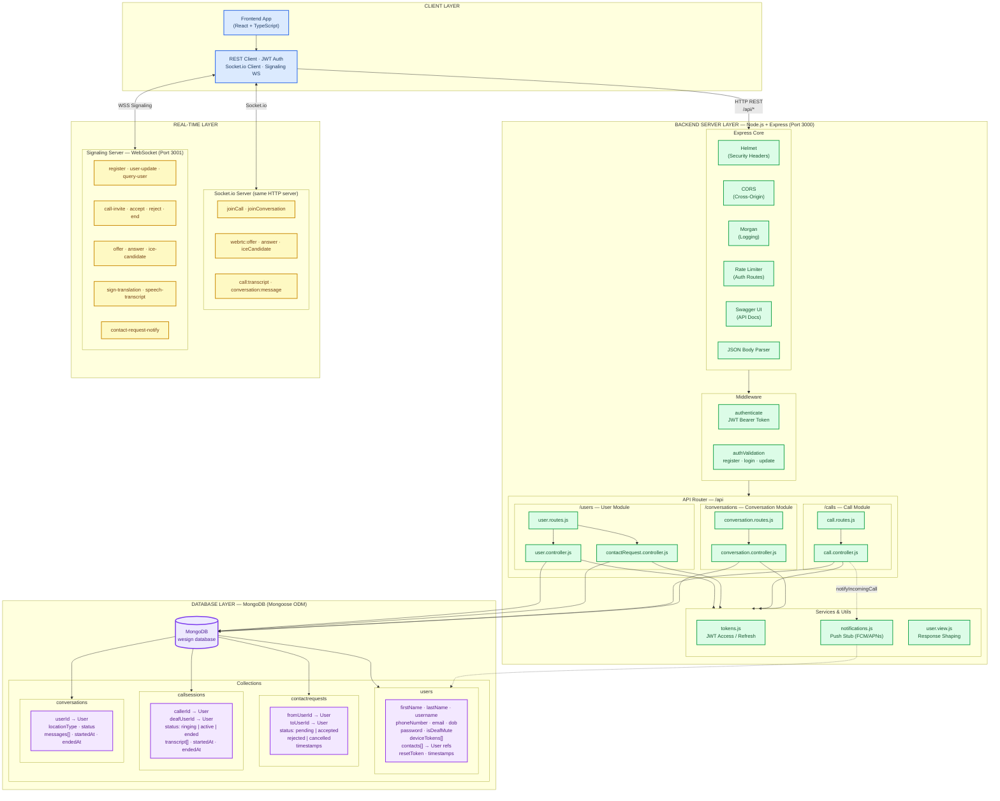
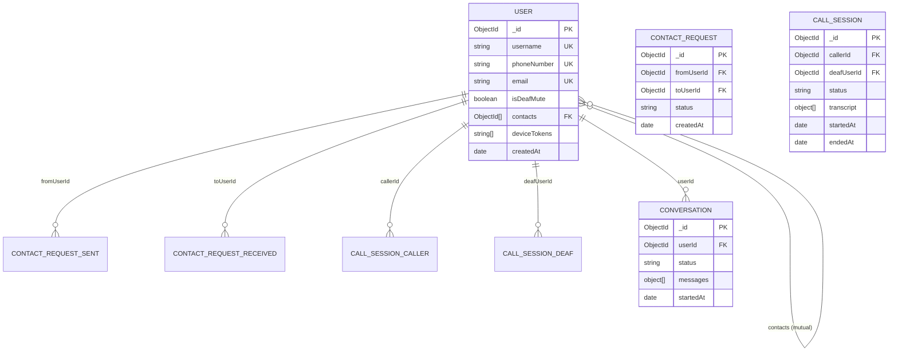
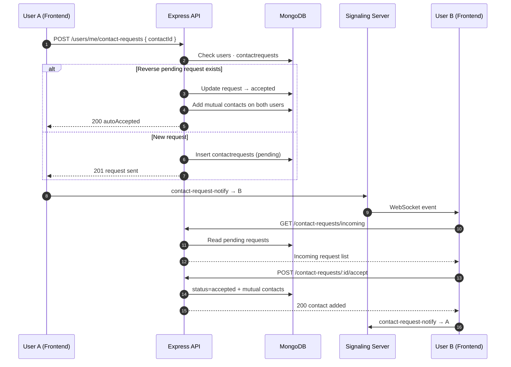

# WeSign Backend & Database Architecture

Detailed block diagram of the **Backend Server**, **real-time services**, and **MongoDB database** — styled like the full system architecture diagram.

**PNG export:** [backend_database_diagram.png](./backend_database_diagram.png)



---

## Layer breakdown

### 1. Client layer (entry point)

| Component | Role |
|-----------|------|
| **REST Client** | Calls `/api/users`, `/api/calls`, `/api/conversations` with JWT |
| **Socket.io Client** | Optional real-time rooms (call / conversation) on main backend |
| **Signaling WS Client** | WebRTC call setup, live translation relay, contact-request notifications |

---

### 2. Backend server layer (Express)

| Component | Responsibility |
|-----------|----------------|
| **Express Core** | Security (Helmet), CORS, logging, rate limiting, Swagger, JSON parsing |
| **Middleware** | `authenticate` (JWT), input validation on auth routes |
| **User module** | Registration, login, profile, search, contacts, **contact requests** |
| **Call module** | Create / accept / end call sessions, store transcripts |
| **Conversation module** | Text chat threads and messages |
| **Services** | JWT token helpers, push notification stub |

#### User API endpoints (database-backed)

| Method | Endpoint | Database action |
|--------|----------|-----------------|
| `POST` | `/users/register` | Insert **users** |
| `POST` | `/users/login` | Read **users**, issue JWT |
| `GET` | `/users/me` | Read **users** |
| `GET` | `/users/me/contacts` | Read **users.contacts** (populated) |
| `DELETE` | `/users/me/contacts/:id` | Mutual remove from **users.contacts** |
| `POST` | `/users/me/contact-requests` | Insert **contactrequests** or auto-accept |
| `GET` | `/users/me/contact-requests/incoming` | Read **contactrequests** (pending) |
| `POST` | `/users/me/contact-requests/:id/accept` | Update request + mutual **users.contacts** |
| `POST` | `/calls` | Insert **callsessions** |
| `POST` | `/conversations` | Insert **conversations** |

---

### 3. Real-time layer

Two separate real-time services:

| Service | Port | Protocol | Purpose |
|---------|------|----------|---------|
| **Main backend Socket.io** | 3000 | Socket.io | Room-based WebRTC relay, transcript streaming |
| **Signaling server** | 3001 | WebSocket (`ws`) | Call invites, P2P signaling, contact-request notify |

> The frontend uses the **signaling server** for live calls. The main backend Socket.io is available for call/conversation rooms and future features.

---

### 4. Database layer (MongoDB)



#### Collection summary

| Collection | Model file | Key relationships |
|------------|------------|-------------------|
| **users** | `user.model.js` | `contacts[]` → other users; stores profile & auth |
| **contactrequests** | `contactRequest.model.js` | `fromUserId` / `toUserId` → users; approval workflow |
| **callsessions** | `callSession.model.js` | `callerId` + `deafUserId` → users; call logs & transcript |
| **conversations** | `conversation.model.js` | `userId` → user; offline text threads |

---

## Contact request data flow

How adding a contact touches the backend and database:



---

## Deployment & connection

| Environment variable | Used by | Purpose |
|---------------------|---------|---------|
| `MONGODB_URI` / `MONGO_URL` | `config/db.js` | MongoDB connection |
| `JWT_ACCESS_SECRET` | `middleware/auth.js` | Token verification |
| `PORT` | `server.js` | Express + Socket.io (default 3000) |

**Production:** Backend deployed (e.g. Railway) with MongoDB Atlas. Signaling server deployed separately on port 3001.

---

## File map (backend source)

```
WeSign-Backend/src/
├── app.js                    Express app setup
├── server.js                 HTTP server + Socket.io + DB connect
├── config/
│   ├── db.js                 MongoDB connection
│   ├── cors.js               CORS rules
│   ├── env.js                Environment validation
│   └── swagger.js            API documentation
├── middleware/
│   ├── auth.js               JWT authentication
│   └── authValidation.js     Request validation
├── routes/
│   ├── index.js              /users · /calls · /conversations
│   ├── user.routes.js
│   ├── call.routes.js
│   └── conversation.routes.js
├── controllers/
│   ├── user.controller.js
│   ├── contactRequest.controller.js
│   ├── call.controller.js
│   └── conversation.controller.js
├── models/
│   ├── user.model.js
│   ├── contactRequest.model.js
│   ├── callSession.model.js
│   └── conversation.model.js
├── realtime/
│   └── socket.js             Socket.io event handlers
└── services/
    └── notifications.js      Push notification stub
```
